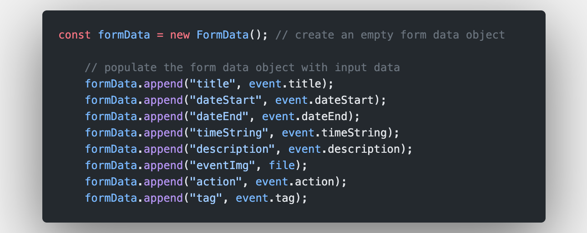

# Frontend Development for Handicaps Welfare Assocation

As part of the General Assembly Software Engineering Immersive (SEI) course, our team of developers worked on creating a website for the Handicaps Welfare Association (HWA). We collaborated closely with the UX Design Immersive (UXDI) class to ensure that the website is designed to meet the needs and preferences of the association's target audience. Our goal was to create an accessible, user-friendly website that provides valuable information and resources to people with disabilities, their families, and the broader community. We used a range of frontend development tools and technologies, including HTML, CSS, JavaScript, Tailwind and the MERN stack, to bring the UXDI team's designs to life. Throughout the development process, we prioritized clear and consistent communication with the UXDI team to ensure that the final product meets the client's needs and exceed their expectations.


## Table of Contents

- [Installation](#installation)
- [Usage](#usage)
- [Technologies](#technologies)
- [Hierarchy](#hierarchy)
- [Frontend Approach](#frontend-approach)
- [Image file storage in MongoDB](#image-file-storage-in-mongodb)
- [Contributors](#contributors)
- [References](#references)

## Installation

1. Clone the repository: git clone https://github.com/unkerpete/GAProj3-HWAfrontend.git
2. Install dependencies:

- npm install
- npm i @headlessui/react
- npm i axios
- npm i buffer
- npm i react-calendar
- npm i react-icons
- npm i react-router-dom
- npm i tw-elements
- npm install -D tailwindcss

3. Start the development server: npm run dev
4. Open http://localhost:3000 or any other port to view it in the browser.

## Usage

This repository should run concurrently with the backend server to retrieve data from the database and store user inputs in the database. You may clone the backend development repository from https://github.com/unkerpete/GAProj3-HWAbackend.

## Technologies

This project uses the following technologies:

- HTML, CSS, Javascript
- TailwindCSS: a utility-first CSS framework
- **M**ongoDB: a NoSQL database used to store and retrieve data
- **E**xpress: a backend web framework for Node.js
- **R**eact: a frontend JavaScript library for building user interfaces
- **N**ode.js: a JavaScript runtime environment for server-side development

## Hierarchy


(If the image is too small for viewing, you may download it from the public directory.)

## Frontend Approach

### Identify Dynamic UI

We identified the following key dynamic UX features:

- Dynamic forms: Forms that adjust or update based on user input or validation errors, providing instant feedback and guidance to the user
- Interactive animations: Animations for tabs, accordians and buttons that respond to user clicking
- Dynamic filtering: Event displays that adjust based on user selected filters

### React & Tailwind

We then used React and Tailwind, which complement each other in building those dynamic features.

- Reusable components: Using React's component-based architecture, we built reusable UI components, which made our code modular and maintainable. We used Tailwind's utility classes to style these components in a flexible and consistent way, making it easier to achieve a consistent look and feel across our entire application.

- Rapid development: Because Tailwind's utility classes provide a large set of pre-defined styles, we could quickly build UI components without having to write custom CSS. This saved us time and allowed us to focus on building functionality rather than tweaking CSS styles.

- Responsive design: Tailwind's responsive utility classes, combined with React's ability to conditionally render components based on state, makes it easy to create responsive and adaptive UIs that work across the entire web applications. For example, we used a single Form component that shows different labels on different pages. We also used a single PictureCard component that renders either a horizontal or vertical layout depending on the state on the page.

### React & Backend

We use React to store states and user input to fetch data from a database:

1. Set up states to store user input or state change events.
2. Create functions to handle user input or state change events.
3. Use the stored states as body or params to fetch data from a database.
4. Set up states to store the fetched data.
5. Update the UI based on the fetched data.

### Image file storage in MongoDB

A dedicated route `/admin` allows for potential users to skip the hassle of interacting with the database to create new information, specifically for the events creation, updating and deleting.

We encountered a challenge here, where part of the CRUD functionality involves working with images. A quick workaround would be to get the user to host the image in a free hosting site, and only have the image url passed and stored into the database to be retrieved later on for rendering purposes.

Instead, we chose to have a single point of access to all these information, and hence had to deal with not only text but image files being stored in the database. This was something new to us, and after much reading, we decided to do the in following manner:

1. Firstly, on the client side, in the form tag for the input fields of various information, there needs to be an input field of `type="file"` in order to allow for user to select a file from locally that user will want to be uploaded to the server.


2. Once user submits the form, the form needs to be structured in a `FormData` object, which uses the encoding type of `"multipart/form-data"`.
3. The relevant input fields would then need to be key/value pairs, and this is done with the `.append()` method.



4. The Form Data object would then need to be passed to the backend API endpoint using fetch. In this case, we defined the endpoint as a `PUT` method. In the headers, the content needs to match as so: `"Content-Type": "multipart/form-data"`, as required by the `multer` middleware.


And that's all on the client side of things.

## Additional Info

If you would like to further customize the site's appearance, feel free to refer to the styling guide below for more information!

### CSS Style Guide

```HTML
    <div>
      <h4 className="bg-peach">Peach</h4>
      <h4 className="bg-primary-800">Green 800</h4>
      <h4 className="bg-primary-600">Green 600</h4>
      <h4 className="bg-primary-400">Green 400</h4>
      <h4 className="bg-primary-200">Green 200</h4>
      <h4 className="bg-white">White</h4>
      <h4 className="bg-secondary-600">Cool Grey 600</h4>
      <h4 className="bg-secondary-400">Cool Grey 400</h4>
      <h4 className="bg-secondary-200">Cool Grey 200</h4>
      <h4 className=" text-primary-800 border-primary-800">
        example : bg-primary-800 / text-primary-800 / border-primary-800
      </h4>
      <br></br>
      <h1>Heading One</h1>
      <span>^^^Dont need Style just use h1 tag</span>
      <p className="font-DM text-3xl font-medium">Heading Two</p>
      <h3>Heading Three </h3>
      <span>^^^Dont need Style just use h3 tag</span>
      <p className="font-DM text-xl font-normal">Body One</p>
      <p className="font-DM text-lg font-normal">Body Two</p>
      <p className="font-DM text-xl font-bold">Body One Bold</p>
      <p className="font-DM text-lg font-bold">Body Two Bold</p>
      <p className="font-DM text-base font-normal">Caption</p>
    </div>
```

## Challenges

- Data inconsistency: Maintaining data consistency between the front-end and back-end required careful attention to detail. When the front-end and back-end had different data structures, keys or validation, inconsistencies occured, which led to bugs and other issues.

- Performance: As we were using the free version of MongoDB Atlas with limited bandwidth, network latency led to slow response times in the display of images.

- Testing: Testing the integration between the front-end and back-end was complex and time-consuming. Often, things did not display as expected when testing the HTTP requests.

## Unsolved Problems & Further Work

- Poorly optimized HTTP requests for events that made the application slow in loading images. We should refactor the code such that we do not have to call the database so many times. We should call the database as infrequently as possible and filter the events on the front-end instead.

- Mapping fetched data led to some props not being rendered, such as the background colour of event tags and the number of search results.

- Minor styling issues that make the web application differ slightly from the original UX design.

- Further optimization of hierarchy.

## Contributors

### SEI Team

1. [Peter Kuang](https://github.com/unkerpete)
2. [Izhar Bin Jumadi](https://github.com/dedhack)
3. [Muhammed Firdaus](https://github.com/mfirdausbn)
4. [Tyler Wong](https://github.com/TylerWong92)
5. [Chen Shujun](https://github.com/chen-shujun23)

### UXDI Team

1. [Luann See](https://www.linkedin.com/in/luann-see/?originalSubdomain=sg)
2. [Nelton Tan](https://www.linkedin.com/in/nelton-tan-63b4b4122/?originalSubdomain=sg)
3. [Grace Duong](https://www.linkedin.com/in/grace-duong-0577a877/?originalSubdomain=sg)
4. [Tay Jiaqi](https://www.linkedin.com/in/jiaqitay/)

## References

- All images were provide by the UXDI team.
- [Figma prototype from the UXDI team](https://www.figma.com/proto/mAoZuGPEzFhi83uKqWOsCq/Proj-3-Fig-Design---Heartz-Design-HWA?page-id=596%3A29933&node-id=596%3A29938&viewport=961%2C528%2C0.02&scaling=scale-down&starting-point-node-id=596%3A29938)

